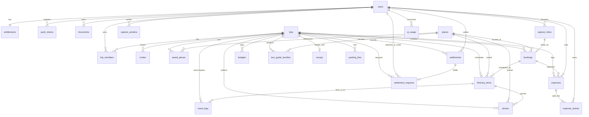

# Database Schema Spec — `.specs/database/schema.spec.md`

> **Task:** T-2.1 · **Status:** DRAFT — pending Sean approval (P-2 gate 2:
> architecture/data model). Not approvable until zero `[NEEDS CLARIFICATION]`
> markers remain.
>
> **Sources:** `docs/PLANNING.md § Architecture` (entity-level data model,
> provider table), `CLAUDE.md` Laws #2/#3/#6, ADR-004 (stack), ADR-005
> (entitlement seams), `.specs/research/payments-settle-up.md`,
> `.specs/research/maps-places.md`, `.specs/research/ai-architecture.md`,
> `.specs/research/booking-integrations.md`.
>
> **Companion spec:** `.specs/shared/contracts.spec.md` — every enum and JSONB
> shape named here is defined once in `@gogo/shared` and imported by the
> Drizzle schema. This file is the Postgres-side contract; that file is the
> TypeScript-side contract. They must never drift.

---

## 1. Scope & global conventions

Column-exact Postgres (Neon) schema for every entity in PLANNING's data model,
implemented with Drizzle ORM in `apps/server/src/db/schema/` and managed by
drizzle-kit migrations (Law #6: a migration for every schema change).

### Global conventions (apply to every table unless noted)

| Convention | Rule |
|---|---|
| Primary keys | `id uuid PRIMARY KEY DEFAULT gen_random_uuid()` (built-in, no extension). Exceptions: natural-key tables (`trip_members`, `expense_shares`, `ai_usage`, `entitlements`, `weather_cache`, `ai_cache`, `place_ingest_regions`) use composite/natural PKs as specced. |
| Timestamps | `timestamptz`, always UTC. `created_at timestamptz NOT NULL DEFAULT now()`; mutable tables also get `updated_at timestamptz NOT NULL DEFAULT now()` (maintained via Drizzle `$onUpdate`, no triggers). |
| Money | **`bigint` integer cents, columns suffixed `_cents`** (Law #2). No `real`/`double precision`/`float` monetary columns anywhere, ever. Fractional-cent internals (AI cost) are stored as integer token counts and priced at read time — never as float money. |
| Currency | `char(3)` ISO-4217 uppercase, `CHECK (col = upper(col))`. |
| Coordinates | `numeric(9,6)` for both lat and lng (±0.11 m precision; covers ±180). No PostGIS in v1 — btree composite indexes suffice at our scale; PostGIS is a later, additive migration if proximity search outgrows bbox queries. |
| Enums | Postgres `pgEnum`s whose value tuples are **imported from `@gogo/shared`** (single source of truth — see contracts spec §3.2). Enum values are append-only (PG can't drop enum values without a rewrite). |
| JSONB | Every `jsonb` column has a documented shape (§3.4) and is **Zod-validated by `@gogo/shared` before every write**. The DB never trusts JSONB content. |
| FK indexes | Every FK column gets a btree index unless it is the leading column of a listed composite/unique index. (Prevents seq-scans on cascade/SET NULL and on the common join direction.) Only *additional* or *composite* indexes are called out per table, with justification. |
| Delete behavior | `trips` cascade to all trip-scoped children. Required references to shared/spine rows (`places`) RESTRICT; optional pins SET NULL. User FKs to shared/financial history RESTRICT (R-db-16 — accounts soft-delete + scrub, never hard-delete, so RESTRICT never fires in practice). Full matrix in §3.6. |
| Soft deletes | None by default; exceptions are explicit per table (`users`, `expenses` — R-db-16, R-db-21). |

---

## 2. Requirements (EARS)

Structural invariants. Each is testable against a migrated database (see
Tasks §4 for the test plan).

- **R-db-1 (money law):** WHEN any monetary value is persisted THE SYSTEM
  SHALL store it as `bigint` integer cents in a column suffixed `_cents`;
  the schema SHALL contain zero floating-point monetary columns
  (CI test: `information_schema.columns` scan — no `real`/`double precision`
  columns at all, and every `*_cents` column is `bigint`).
- **R-db-2 (expense atomicity):** WHEN an expense is created, or its amount /
  split is modified, THE SYSTEM SHALL write the `expenses` row and all its
  `expense_shares` rows in a single database transaction, and SHALL reject
  the write unless `SUM(expense_shares.share_cents) = expenses.amount_cents`
  exactly (validated server-side pre-commit; no rounding remainder may be
  dropped — remainder cents are assigned deterministically to shares).
- **R-db-3 (photo privacy default):** WHEN a `photos` row is inserted without
  an explicit visibility THE SYSTEM SHALL persist `visibility = 'private'`
  (enforced by a `NOT NULL DEFAULT 'private'` column, not application code
  alone). (Law #3.)
- **R-db-4 (visibility is a DB-level boundary):** WHEN any query reads photos
  on behalf of a user who is not the photo's owner THE SYSTEM SHALL filter by
  visibility (`'trip'` requires trip membership; `'public'` is the only level
  readable by non-members). The schema SHALL provide the indexes that make the
  filtered queries the natural, cheap path (§ photos).
- **R-db-5 (entitlement seam):** WHEN a `users` row is created THE SYSTEM
  SHALL create its `entitlements` row (plan `'free'`) in the same transaction;
  WHEN any AI endpoint executes THE SYSTEM SHALL read `entitlements` +
  `ai_usage` for the caller within the request before calling the model
  (ADR-005; structural support: `ai_usage` PK `(user_id, feature, day)`
  enables a single upsert-increment).
- **R-db-6 (places spine identity):** WHEN open-data places are imported THE
  SYSTEM SHALL upsert on `(source, source_id)`; the schema SHALL enforce
  uniqueness of `(source, source_id)` where `source_id IS NOT NULL`, and
  SHALL require `source_id IS NULL` exactly when `source = 'custom'`.
- **R-db-7 (capture is never silent):** WHEN capture parsing fails or is
  low-confidence THE SYSTEM SHALL persist the `capture_inbox` row with
  `parse_status` `'failed'` or `'needs_review'` and an `error`/`parsed`
  payload — capture rows are never deleted as a failure-handling path.
- **R-db-8 (one owner):** THE SYSTEM SHALL allow at most one
  `trip_members` row with `role = 'owner'` per trip (partial unique index)
  and SHALL enforce at-least-one-owner server-side on every membership write.
- **R-db-9 (invite tokens):** WHEN an invite is created THE SYSTEM SHALL
  generate a token with ≥ 128 bits of entropy, stored unique; expired or
  revoked invites SHALL be rejected at acceptance time (schema: `expires_at`,
  `revoked_at`).
- **R-db-10 (AI cache is user-anonymous):** WHEN an AI response is cached THE
  SYSTEM SHALL key it as
  `hash(feature, destination, travel_style, season, schema_version)` and the
  `ai_cache` row SHALL contain no user identifier (shareable across users).
- **R-db-11 (booking details are typed):** WHEN a booking is persisted THE
  SYSTEM SHALL validate `details` against the `@gogo/shared` schema for its
  `category` (discriminated union, §3.4.1) before write; unknown keys are
  stripped.
- **R-db-12 (migration law):** WHEN the schema changes THE SYSTEM SHALL ship
  a drizzle-kit migration in the same PR; no ad-hoc drift (Law #6). The
  initial migration created by this spec's task is the baseline.
- **R-db-13 (currency integrity):** WHEN a monetary column is non-null THE
  SYSTEM SHALL have a non-null ISO-4217 uppercase currency alongside it
  (checks per table), and `expense_shares` SHALL inherit their currency from
  the parent expense (no per-share currency column — shares are always in the
  expense's currency).
- **R-db-14 (settlements are record-only):** THE SYSTEM SHALL store
  settlements as ledger entries only — no external transaction IDs, no
  payment-state machine, no money movement (research: record-only +
  deeplink handoff; "Mark as settled" always works standalone).
- **R-db-15 (leg identity):** THE SYSTEM SHALL store at most one travel leg
  per `(from_item_id, to_item_id, mode)`; legs are derived data, recomputed
  at sync, and safe to delete/rebuild.
- **R-db-16 (user rows are load-bearing):** THE SYSTEM SHALL use
  `ON DELETE RESTRICT` for all FKs to `users` that carry shared financial or
  collaborative history (`expenses.paid_by`, `expense_shares.user_id`,
  `settlements.from/to`, `trips.created_by`). Account deletion is
  **soft-delete + PII scrub**: WHEN an account is deleted THE SYSTEM SHALL
  keep the `users` row, set `deleted_at`, and scrub all PII columns (§3.3.1
  scrub list); the scrubbed row renders as "Deleted user" and
  expense/settlement ledger integrity survives for the remaining trip
  members. Rows are never hard-deleted, so RESTRICT never blocks deletion —
  it exists to make accidental hard deletes impossible. The App Store
  account-deletion mandate is satisfied by the scrub; the deletion endpoint
  is owned by the auth spec (`.specs/api/auth-users.spec.md`).
  (Resolved 2026-07-09, Gate 2)
- **R-db-17 (jsonb validation):** WHEN any JSONB column is written THE SYSTEM
  SHALL have validated the payload against its `@gogo/shared` schema in the
  same request (R-shared-10 is the mirror requirement).
- **R-db-18 (documents are private):** THE SYSTEM SHALL scope every
  `documents` read to `user_id = caller` — documents never gain trip-level or
  public visibility regardless of `trip_id` association (Law #3; the vault is
  personal).
- **R-db-19 (trip status is derived, override wins):** `trips.status` stores
  the effective status. WHILE `status_override` IS NULL THE SYSTEM SHALL keep
  `status` equal to the date-derived value (the `derived_status` helper in
  `@gogo/shared` — trips spec §3.4) via a daily reconciliation job plus
  on-write recompute; WHEN `status_override` is set THE SYSTEM SHALL write
  `status = status_override` in the same transaction and skip reconciliation
  for that trip until the override is cleared (clearing recomputes from
  dates). (Resolved 2026-07-09, Gate 2)
- **R-db-20 (FX capture):** WHEN an expense is logged in a currency other
  than the trip base currency THE SYSTEM SHALL persist `fx_rate` and
  `base_amount_cents` captured at entry time — rate auto-fetched from the
  FX-rate provider when online (provider selection is a build-phase
  escalation, §3.7), manual entry/override always available, never
  re-fetched after write. Balances are always computed and shown in trip
  base currency. (Resolved 2026-07-09, Gate 2)
- **R-db-21 (expense soft delete):** WHEN an expense is deleted THE SYSTEM
  SHALL set `deleted_at`/`deleted_by` rather than removing the row; deleted
  expenses SHALL be excluded from balance and budget computations and SHALL
  remain visible as an audit-trail entry ("{name} deleted '{description}'",
  Splitwise-style). Hard deletes of expenses SHALL NOT exist.
  (Resolved 2026-07-09, Gate 2)
- **R-db-22 (capture raw retention):** WHEN a capture lands as a booking
  (user confirm) or the `capture_inbox` row reaches 30 days of age —
  whichever comes first — THE SYSTEM SHALL delete the raw payload object and
  set `raw_ref` NULL; the queue row and its `parsed` proposal survive
  (R-db-7 — the raw PII goes, the visible history stays).
  (Resolved 2026-07-09, Gate 2)

---

## 3. Design

### 3.1 ERD

Standalone (no FK relationships): `ai_cache`, `weather_cache` — pure
destination-keyed caches, deliberately user- and trip-anonymous — and
`place_ingest_regions` (region-grid ingest bookkeeping, §3.3.24).

Auth-owned tables (`auth_sessions`, `refresh_tokens`, `apple_credentials`)
are specced canonically in `.specs/api/auth-users.spec.md` §3.3 and omitted
from this ERD — cross-reference in §3.3.28. (Resolved 2026-07-09, Gate 2)

### 3.2 Enums (canonical values — defined in `@gogo/shared`, mirrored as pgEnums)

| pgEnum | Values | Notes |
|---|---|---|
| `place_source` | `overture`, `fsq_os`, `custom` | Open-data spine provenance |
| `trip_status` | `planning`, `active`, `past` | Per PLANNING exactly |
| `trip_member_role` | `owner`, `editor`, `viewer` | Reused by `invites.role` with `CHECK (role <> 'owner')` |
| `booking_category` | `lodging`, `flight`, `train`, `car_rental`, `moped_rental`, `activity`, `restaurant`, `other` | Per PLANNING exactly |
| `booking_status` | `idea`, `planned`, `booked`, `cancelled` | `cancelled` added per T-2.1 scope beyond PLANNING's three — capture emails include cancellations and deletion would destroy expense links. Semantics: `idea` = candidate under consideration; `planned` = committed to the itinerary, not yet purchased; `booked` = confirmed/purchased; `cancelled` = terminal, kept for history. |
| `booking_source` | `manual`, `email`, `share`, `deeplink_return` | `deeplink_return` = user confirmed a booking after returning from a deeplink-out |
| `itinerary_item_kind` | `booking`, `place_visit`, `custom` | Per PLANNING ("booking-ref \| place-visit \| custom") |
| `travel_mode` | `driving`, `walking`, `cycling`, `transit` | Mapbox profiles + Transitous; transit degrades gracefully (rows simply absent) |
| `expense_category` | `lodging`, `transport`, `food`, `activities`, `shopping`, `other` | Fixed enum v1, not user-definable; aligned with booking categories. (Resolved 2026-07-09, Gate 2) |
| `settlement_method` | `venmo`, `cashapp`, `paypal`, `zelle`, `cash` | Per PLANNING exactly; record-only |
| `request_status` | `open`, `settled`, `cancelled` | `settlement_requests` lifecycle (§3.3.25; added with the Gate-2 entity approval) |
| `capture_source` | `email`, `share` | |
| `parse_status` | `pending`, `parsed`, `needs_review`, `failed` | Per PLANNING exactly. "Landed" is not a status — a capture has landed iff a `bookings.capture_id` row references it. |
| `photo_visibility` | `private`, `trip`, `public` | Law #3; DB default `private` |
| `ai_feature` | `recommendations`, `expense_estimate`, `tour_guide`, `packing_list`, `recap`, `capture_parse` | `capture_parse` is tracked in `ai_usage` for spend/kill-switch math (the rollup is the only spend ledger — ai spec §3.3) but is **cap-exempt** from the user's 30/day AI cap; a separate structural ceiling of 20 captures/day applies (config in `@gogo/shared`, enforced by the capture spec). (Resolved 2026-07-09, Gate 2) |
| `document_kind` | `passport`, `visa`, `insurance`, `other` | Append-only extendable; `other` + `title` covers the tail |
| `plan` | `free` | ADR-005: seams now, plans later; append-only |
| `push_platform` | `ios`, `android` | |
| `bundle_status` | `pending`, `ready`, `failed` | Batch pre-gen is async (hours) |

### 3.3 Tables (column-exact)

Conventions from §1 apply; `created_at`/`updated_at` are listed only in the
convention, not repeated per table (every table has `created_at`; mutable
tables have `updated_at` — immutable ledger tables `settlements`,
`expense_shares`, `travel_legs`, `ai_cache`, `weather_cache` omit it).

---

#### 3.3.1 `users`

| Column | Type | Null | Default | Notes |
|---|---|---|---|---|
| `id` | `uuid` | no | `gen_random_uuid()` | PK |
| `email` | `text` | no | — | Unique on `lower(email)`. Apple private-relay addresses are still emails. |
| `display_name` | `text` | no | — | |
| `avatar_key` | `text` | yes | — | Object-storage key (provider-agnostic; storage provider is a P-3 escalation, see §3.7) |
| `apple_sub` | `text` | yes | — | Apple `sub` claim; UNIQUE |
| `google_sub` | `text` | yes | — | Google `sub` claim; UNIQUE |
| `prefs` | `jsonb` | no | `'{}'` | `UserPrefs` shape (§3.4.6; defined in contracts spec — includes `travel_style`, which feeds the AI cache key) |
| `venmo_username` | `text` | yes | — | Stored without `@` (research: `recipients=` takes bare usernames) |
| `cashtag` | `text` | yes | — | Stored without `$`; HEAD-validated against `cash.app` at save time (research: 404 = invalid) |
| `paypalme_username` | `text` | yes | — | |
| `zelle_handle` | `text` | yes | — | Email or US phone (E.164); no deeplink exists — rendered as copyable handle |
| `zelle_display_name` | `text` | yes | — | Shown next to the handle so the payer can verify the recipient (Zelle QR payload precedent: `{token, name}`) |
| `forward_email_slug` | `text` | yes | — | UNIQUE. Local part of the user's permanent capture address (`<slug>@in.<domain>` → CloudMailin webhook attributes inbound mail to the user). Generated at first capture-feature use. |
| `deleted_at` | `timestamptz` | yes | — | Soft-delete stamp (R-db-16); set by the account-deletion flow together with the PII scrub below |

- **PK:** `id` · **Unique:** `lower(email)`, `apple_sub`, `google_sub`, `forward_email_slug`
- **Checks:** `deleted_at IS NOT NULL OR apple_sub IS NOT NULL OR google_sub IS NOT NULL` (every live account has ≥ 1 identity; zero passwords stored — Gate-1 auth lock; scrubbed accounts have none)
- **Indexes:** unique indexes above cover all lookup paths (login by provider sub, capture by slug).
- Identity linking: WHEN a sign-in arrives from a new provider whose verified
  email matches an existing account THE SYSTEM SHALL auto-link — set the
  missing `apple_sub`/`google_sub` on the existing account rather than
  creating a second account. One account per email; `lower(email)` uniqueness
  is the merge key. Flow details are the auth spec's (R-auth-6 email-collision
  branch). (Resolved 2026-07-09, Gate 2)
- Account deletion (R-db-16): soft-delete + PII scrub. Scrub list: `email` →
  unique tombstone (`deleted:<id>`), `display_name` → `'Deleted user'`,
  `avatar_key`/`apple_sub`/`google_sub`/payment handles/`zelle_display_name`/
  `forward_email_slug` → NULL, `prefs` → `'{}'`; `deleted_at = now()`.
  Ledger rows referencing the user survive untouched.
  (Resolved 2026-07-09, Gate 2)
- Out of scope here: session/refresh-token storage — owned by the auth spec,
  which specs `auth_sessions`, `refresh_tokens`, and `apple_credentials`
  canonically (`.specs/api/auth-users.spec.md` §3.3) following this spec's
  conventions; cross-reference in §3.3.28.

#### 3.3.2 `entitlements` (ADR-005)

| Column | Type | Null | Default | Notes |
|---|---|---|---|---|
| `user_id` | `uuid` | no | — | PK; FK → `users.id` ON DELETE CASCADE |
| `plan` | `plan` | no | `'free'` | |
| `overrides` | `jsonb` | no | `'{}'` | `EntitlementOverrides` shape (§3.4.7). Per-user exceptions to the plan's defaults. Plan **defaults** (e.g. `ai_calls_per_day: 30`) live in `@gogo/shared` config keyed by plan — gating later is config, not migration (ADR-005). |

- **PK:** `user_id` · Created in the same transaction as the user (R-db-5).
- Seam semantics: effective cap = `overrides.ai_calls_per_day ?? PLAN_DEFAULTS[plan].ai_calls_per_day`. Free-forever list (offline, collab, splitting) has **no seam columns by design** — ADR-005 forbids ever gating them.

#### 3.3.3 `push_tokens`

| Column | Type | Null | Default | Notes |
|---|---|---|---|---|
| `id` | `uuid` | no | `gen_random_uuid()` | PK |
| `user_id` | `uuid` | no | — | FK → `users.id` ON DELETE CASCADE |
| `token` | `text` | no | — | Expo push token; UNIQUE (a token re-registered by another account moves, not duplicates) |
| `platform` | `push_platform` | no | — | |
| `last_seen_at` | `timestamptz` | no | `now()` | Bumped on app foreground; prune job deletes stale (>90d) and `DeviceNotRegistered` tokens |
| `timezone` | `text` | yes | — | Optional IANA tz captured at registration; digest fallback when trip destination tz unavailable (Gate 2, H8 — companion to notifications spec) |

- **Unique:** `token` · **Indexes:** `(user_id)` — fan-out "notify trip members" resolves members → tokens.

#### 3.3.4 `trips`

| Column | Type | Null | Default | Notes |
|---|---|---|---|---|
| `id` | `uuid` | no | `gen_random_uuid()` | PK |
| `name` | `text` | no | — | |
| `destination_name` | `text` | no | — | Display string ("Tokyo, Japan") |
| `destination_lat` | `numeric(9,6)` | no | — | Map centering, weather, AI grounding — guaranteed present (structured destination input, note below) |
| `destination_lng` | `numeric(9,6)` | no | — | |
| `start_date` | `date` | no | — | Required at creation (note below) |
| `end_date` | `date` | no | — | |
| `status` | `trip_status` | no | `'planning'` | Effective status; date-derived unless overridden (R-db-19) |
| `status_override` | `trip_status` | yes | — | Manual override; wins until cleared (R-db-19). Owner-only write (trips spec §3.4 — "archive" = override to `'past'`) |
| `base_currency` | `char(3)` | no | `'USD'` | Budget/balance reporting currency for the trip; expenses in other currencies convert into it (R-db-20) |
| `budget_cap_cents` | `bigint` | yes | — | Optional **overall** trip budget cap in `base_currency`; `CHECK (budget_cap_cents >= 0)`; NULL = no overall cap. Trip-level column, not a `budgets` pseudo-category row — keeps `expense_category` clean of a `total` value that `expenses.category` could never use. (Resolved 2026-07-09, Gate 2) |
| `theme` | `text` | yes | — | Trip accent key into `packages/tokens` — colors small trip-scoped accents only, never a whole-app re-skin (tokens spec Gate-2 theme-scope resolution); null = app default |
| `created_by` | `uuid` | no | — | FK → `users.id` ON DELETE RESTRICT. Immutable creator; *ownership* lives in `trip_members.role` |

- **Checks:** `start_date <= end_date`; `base_currency = upper(base_currency)`; `budget_cap_cents >= 0`
- **Indexes:** FK index on `created_by`. Trip lists are queried through `trip_members(user_id)` — no extra index here.
- Trip dates are **required at creation** — unlocks season/AI/tile triggers
  unconditionally; date-less trips are deferred (a future nullability
  relaxation is additive). (Resolved 2026-07-09, Gate 2)
- Destination input is **structured**: picked via search against an
  Overture city/locality subset (free, no new dependency), so
  `destination_lat`/`destination_lng` are always present and weather/AI
  grounding is guaranteed for every trip. Free-text destinations do not
  exist in v1. (Resolved 2026-07-09, Gate 2)
- `status` transitions: date-derived (planning → active on `start_date`,
  active → past after `end_date`) with manual override allowed — override
  wins until cleared (R-db-19; mechanism above).
  (Resolved 2026-07-09, Gate 2)

#### 3.3.5 `trip_members`

| Column | Type | Null | Default | Notes |
|---|---|---|---|---|
| `trip_id` | `uuid` | no | — | FK → `trips.id` ON DELETE CASCADE |
| `user_id` | `uuid` | no | — | FK → `users.id` ON DELETE CASCADE |
| `role` | `trip_member_role` | no | — | |
| `joined_at` | `timestamptz` | no | `now()` | |

- **PK:** `(trip_id, user_id)`
- **Unique (partial):** `uq_trip_single_owner` on `(trip_id) WHERE role = 'owner'` — at most one owner (R-db-8); at-least-one enforced server-side.
- **Indexes:** `(user_id)` — "my trips" is the app's root query.
- Ownership transfer: an owner MAY transfer ownership (self-demote + promote
  another member in one transaction — the partial unique makes any other
  ordering fail); an owner CANNOT leave a trip with other members without
  transferring first. Enforced server-side with the at-least-one-owner rule
  (R-db-8). (Resolved 2026-07-09, Gate 2)

#### 3.3.6 `invites`

| Column | Type | Null | Default | Notes |
|---|---|---|---|---|
| `id` | `uuid` | no | `gen_random_uuid()` | PK |
| `trip_id` | `uuid` | no | — | FK → `trips.id` ON DELETE CASCADE |
| `token` | `text` | no | — | UNIQUE; ≥128-bit entropy, URL-safe (R-db-9) |
| `role` | `trip_member_role` | no | — | `CHECK (role <> 'owner')` — invites grant editor/viewer only |
| `created_by` | `uuid` | no | — | FK → `users.id` ON DELETE RESTRICT |
| `expires_at` | `timestamptz` | no | — | Server default: `now() + 7 days` (application-supplied on create; adjustable per invite) |
| `revoked_at` | `timestamptz` | yes | — | |
| `max_uses` | `integer` | yes | — | `CHECK (max_uses > 0)`; NULL = unlimited until expiry (the default) |
| `use_count` | `integer` | no | `0` | Incremented on acceptance |

- **Unique:** `token` · **Indexes:** FK indexes (`trip_id`, `created_by`).
- Acceptance (server-side, one transaction): validate token not expired/revoked, `use_count < max_uses` (when set), upsert `trip_members`, increment `use_count`.
- Invite links are **shareable multi-use group links** (Splitwise-style
  "anyone with the link joins") with a 7-day default expiry, revocable at
  any time (`revoked_at`), and an optional `max_uses` cap the creator may
  set. (Resolved 2026-07-09, Gate 2)

#### 3.3.7 `places` — the open-data spine

Legally storable forever, LLM-safe (Overture CDLA-P-2.0/Apache-2.0/CC0; FSQ OS
Apache-2.0). Deliberately minimal: rich/volatile details (hours, ratings,
photos) are **fetch-fresh from the Foursquare hosted API and never cached**
(licensing) — do not add such columns.

| Column | Type | Null | Default | Notes |
|---|---|---|---|---|
| `id` | `uuid` | no | `gen_random_uuid()` | PK — our stable id; everything references this, never `source_id` |
| `source` | `place_source` | no | — | `overture` / `fsq_os` / `custom` |
| `source_id` | `text` | yes | — | Upstream id (Overture GERS id / FSQ id); NULL iff `source = 'custom'` |
| `name` | `text` | no | — | |
| `lat` | `numeric(9,6)` | no | — | |
| `lng` | `numeric(9,6)` | no | — | |
| `category` | `text` | yes | — | Source taxonomy string, normalized where cheap (Overture and FSQ taxonomies differ; normalization mapping is a places-domain concern, not schema) |
| `wiki_ref` | `text` | yes | — | Wikidata QID preferred (`Q…`); Wikipedia title accepted. Grounds the tour guide (Wikipedia/Wikivoyage enrichment) |
| `created_by` | `uuid` | yes | — | FK → `users.id` ON DELETE RESTRICT; set iff `source = 'custom'` (authz for edits to user-created places) |

- **Unique (partial):** `(source, source_id) WHERE source_id IS NOT NULL` — import upsert key (R-db-6)
- **Checks:** `(source = 'custom') = (source_id IS NULL)`; `source <> 'custom' OR created_by IS NOT NULL`
- **Indexes:** `(lat, lng)` composite — bbox queries for map viewport; GIN `gin_trgm_ops` on `name` (extension `pg_trgm`, enabled in the initial migration) — type-ahead place search against our spine before any paid autocomplete.
- Bulk Overture/FSQ import tooling is **out of scope** for this spec (places-domain task); the upsert key above is its contract.

#### 3.3.8 `saved_places`

| Column | Type | Null | Default | Notes |
|---|---|---|---|---|
| `id` | `uuid` | no | `gen_random_uuid()` | PK |
| `trip_id` | `uuid` | no | — | FK → `trips.id` ON DELETE CASCADE |
| `place_id` | `uuid` | no | — | FK → `places.id` ON DELETE RESTRICT (a pinned spine row must not vanish) |
| `note` | `text` | yes | — | |
| `created_by` | `uuid` | yes | — | FK → `users.id` ON DELETE SET NULL — attribution in collab trips; nullable so member removal doesn't lose the pin |

- **Unique:** `(trip_id, place_id)` — a place is saved once per trip (also serves the trip's saved-list query)
- **Indexes:** FK index on `place_id`.

#### 3.3.9 `bookings`

| Column | Type | Null | Default | Notes |
|---|---|---|---|---|
| `id` | `uuid` | no | `gen_random_uuid()` | PK |
| `trip_id` | `uuid` | no | — | FK → `trips.id` ON DELETE CASCADE |
| `category` | `booking_category` | no | — | |
| `status` | `booking_status` | no | `'idea'` | |
| `title` | `text` | no | — | Display name ("UA 837 SFO→NRT", "Park Hyatt Tokyo") |
| `details` | `jsonb` | no | `'{}'` | Per-category shape (§3.4.1), Zod-validated (R-db-11) |
| `starts_at` | `timestamptz` | yes | — | **Denormalized** from `details` (UTC instant) for sorting/leg computation; source of truth for display times (incl. local-time semantics) is `details` |
| `ends_at` | `timestamptz` | yes | — | Same; `CHECK (starts_at IS NULL OR ends_at IS NULL OR starts_at <= ends_at)` |
| `price_cents` | `bigint` | yes | — | `CHECK (price_cents >= 0)`; NULL = unknown (ideas often have no price) |
| `currency` | `char(3)` | yes | — | `CHECK (price_cents IS NULL OR currency IS NOT NULL)` (R-db-13); uppercase check |
| `confirmation_code` | `text` | yes | — | PNR / reservation code |
| `source` | `booking_source` | no | `'manual'` | |
| `capture_id` | `uuid` | yes | — | FK → `capture_inbox.id` ON DELETE SET NULL; **partial unique WHERE NOT NULL** — one booking per capture; "capture landed" = this reverse reference exists |
| `place_id` | `uuid` | yes | — | FK → `places.id` ON DELETE SET NULL — map pin (hotel, venue, restaurant) |
| `created_by` | `uuid` | no | — | FK → `users.id` ON DELETE RESTRICT |

- **Indexes:** `(trip_id, starts_at)` — chronological booking list + leg/today-view queries; `(trip_id, status)` — "ideas" vs "booked" tabs; partial unique on `capture_id`; FK index on `place_id`.
- Scheduling relationship: a booking's calendar presence is its
  `itinerary_items` row(s) (kind `booking`). For those items, `day`/times
  derive from the booking and are updated in the same transaction when the
  booking's times change (single source of truth: the booking).

#### 3.3.10 `itinerary_items`

Everything on the calendar: booking refs, place visits, custom blocks.

| Column | Type | Null | Default | Notes |
|---|---|---|---|---|
| `id` | `uuid` | no | `gen_random_uuid()` | PK |
| `trip_id` | `uuid` | no | — | FK → `trips.id` ON DELETE CASCADE |
| `kind` | `itinerary_item_kind` | no | — | |
| `booking_id` | `uuid` | yes | — | FK → `bookings.id` ON DELETE CASCADE (booking removed ⇒ its calendar item goes) |
| `place_id` | `uuid` | yes | — | FK → `places.id` ON DELETE RESTRICT |
| `title` | `text` | yes | — | Required for `custom`; derived from booking/place otherwise |
| `notes` | `text` | yes | — | |
| `day` | `date` | no | — | Trip-local calendar day (wall-date, no tz math — itineraries are planned in destination local time by nature) |
| `end_day` | `date` | yes | — | `CHECK (end_day IS NULL OR end_day >= day)` — set for multi-day spanning items (resolution note below) |
| `start_time` | `time` | yes | — | Local wall-time on `day`; NULL = all-day/unscheduled |
| `end_time` | `time` | yes | — | |
| `sort_order` | `integer` | no | `0` | Order within a day; app assigns gapped values (1024 steps) and re-indexes the day's items when gaps exhaust |
| `created_by` | `uuid` | no | — | FK → `users.id` ON DELETE RESTRICT |

- **Checks (kind shape):** `kind = 'booking'` ⇒ `booking_id IS NOT NULL`; `kind = 'place_visit'` ⇒ `place_id IS NOT NULL`; `kind = 'custom'` ⇒ `title IS NOT NULL`; `booking_id IS NULL OR kind = 'booking'`.
- **Indexes:** `(trip_id, day, sort_order)` — THE itinerary query (day list and calendar grid both read a day/range ordered); FK indexes on `booking_id` (booking→item sync on time change) and `place_id`.
- Multi-day bookings (lodging check-in→check-out, cross-midnight arrivals)
  are **one spanning row** — Branch A of the itinerary-bookings spec §3.6:
  `day` = check-in wall-date, `end_day` = check-out wall-date, times =
  check-in/check-out wall times; `end_day` stays. Rendering: the calendar
  grid draws the spanning item across its days in the all-day lane; the day
  list renders derived check-in/check-out point entries on `day` and
  `end_day` (client rendering of the single row — never two DB rows).
  (Resolved 2026-07-09, Gate 2)

#### 3.3.11 `travel_legs`

Derived data — precomputed at trip sync for offline ETAs (Mapbox
drive/walk/cycle, Transitous transit; directions APIs are online-only).
Rebuildable at any time; no `updated_at` (rows are replaced, not edited).

| Column | Type | Null | Default | Notes |
|---|---|---|---|---|
| `id` | `uuid` | no | `gen_random_uuid()` | PK |
| `trip_id` | `uuid` | no | — | FK → `trips.id` ON DELETE CASCADE |
| `from_item_id` | `uuid` | no | — | FK → `itinerary_items.id` ON DELETE CASCADE |
| `to_item_id` | `uuid` | no | — | FK → `itinerary_items.id` ON DELETE CASCADE; `CHECK (from_item_id <> to_item_id)` |
| `mode` | `travel_mode` | no | — | Transit rows simply absent when Transitous degrades (graceful degradation — hide the mode, don't fail) |
| `duration_seconds` | `integer` | no | — | `CHECK (>= 0)` |
| `distance_meters` | `integer` | no | — | `CHECK (>= 0)` |
| `provider` | `text` | no | — | `'mapbox'` / `'transitous'` — text, not enum (providers are a moving target; no migration per provider change) |
| `computed_at` | `timestamptz` | no | — | Staleness input for the leg-ETA refresh job |

- **Unique:** `(from_item_id, to_item_id, mode)` (R-db-15) · **Indexes:** `(trip_id)` — offline bundle downloads all legs for a trip in one query.
- App-layer invariant: both items belong to `trip_id` (not expressible as a simple FK; enforced by the leg-computation job which is the only writer).
- Route geometry (polyline) intentionally excluded in v1 — PLANNING specs duration/distance only; adding geometry later is additive.

#### 3.3.12 `expenses`

| Column | Type | Null | Default | Notes |
|---|---|---|---|---|
| `id` | `uuid` | no | `gen_random_uuid()` | PK |
| `trip_id` | `uuid` | no | — | FK → `trips.id` ON DELETE CASCADE |
| `description` | `text` | no | — | |
| `category` | `expense_category` | no | — | Counts against `budgets` caps (fixed enum, §3.2) |
| `paid_by` | `uuid` | no | — | FK → `users.id` ON DELETE RESTRICT (R-db-16) |
| `amount_cents` | `bigint` | no | — | `CHECK (amount_cents > 0)` |
| `currency` | `char(3)` | no | — | As logged (spend-in-local-currency); uppercase check |
| `fx_rate` | `numeric(18,8)` | yes | — | Rate `currency → trip.base_currency` captured at entry when the expense currency differs (R-db-20) |
| `base_amount_cents` | `bigint` | yes | — | `amount_cents` converted to trip base currency; app invariant: equals `amount_cents` (rate 1) when `currency = trip.base_currency`. `CHECK ((fx_rate IS NULL) = (base_amount_cents IS NULL))` |
| `booking_id` | `uuid` | yes | — | FK → `bookings.id` ON DELETE SET NULL — expense spawned from a booking's price |
| `spent_at` | `date` | no | `CURRENT_DATE` | Daily-spend views |
| `created_by` | `uuid` | no | — | FK → `users.id` ON DELETE RESTRICT — logger may differ from payer |
| `deleted_at` | `timestamptz` | yes | — | Soft delete (R-db-21); balance/budget queries filter `deleted_at IS NULL` |
| `deleted_by` | `uuid` | yes | — | FK → `users.id` ON DELETE RESTRICT — who deleted (audit trail); `CHECK ((deleted_at IS NULL) = (deleted_by IS NULL))` |

- **Indexes:** `(trip_id, spent_at)` — money screen lists and daily rollups; FK indexes on `paid_by`, `booking_id`.
- **Atomicity:** R-db-2 — expense + shares single transaction, `SUM(share_cents) = amount_cents`, deterministic remainder assignment (largest-remainder by member id order; exact algorithm is the expenses API spec's to pin, the invariant is this spec's).
- Balances are computed, never stored: pairwise balances derive from
  `expenses`/`expense_shares`/`settlements` per trip in base currency,
  excluding soft-deleted expenses (R-db-21).
- Multi-currency policy (R-db-20): store original `amount_cents` + `currency`
  plus `base_amount_cents` + `fx_rate` captured at entry; rate auto-fetched
  from a free FX-rate API when online (approved new-dependency escalation,
  provider chosen at build — §3.7), manual entry/override always available;
  never re-fetched after write. Balances shown always in trip base currency.
  (Resolved 2026-07-09, Gate 2)
- Expense deletion (R-db-21): soft delete with a visible audit trail
  ("Sean deleted 'Dinner ¥12,000'"), Splitwise-style — `deleted_at`/
  `deleted_by` above; balance and budget queries filter deleted rows.
  (Resolved 2026-07-09, Gate 2)

#### 3.3.13 `expense_shares`

| Column | Type | Null | Default | Notes |
|---|---|---|---|---|
| `expense_id` | `uuid` | no | — | FK → `expenses.id` ON DELETE CASCADE |
| `user_id` | `uuid` | no | — | FK → `users.id` ON DELETE RESTRICT (R-db-16) |
| `share_cents` | `bigint` | no | — | `CHECK (share_cents >= 0)`; currency inherited from parent expense (R-db-13) |

- **PK:** `(expense_id, user_id)` · **Indexes:** `(user_id)` — cross-trip "what do I owe" summaries.
- The payer normally holds a share too (their own portion); a zero share is legal (payer covered others entirely).

#### 3.3.14 `settlements`

Record-only ledger entries (R-db-14). Immutable once written (no `updated_at`).

| Column | Type | Null | Default | Notes |
|---|---|---|---|---|
| `id` | `uuid` | no | `gen_random_uuid()` | PK |
| `trip_id` | `uuid` | no | — | FK → `trips.id` ON DELETE CASCADE |
| `from_user_id` | `uuid` | no | — | FK → `users.id` ON DELETE RESTRICT; payer |
| `to_user_id` | `uuid` | no | — | FK → `users.id` ON DELETE RESTRICT; `CHECK (from_user_id <> to_user_id)` |
| `amount_cents` | `bigint` | no | — | `CHECK (amount_cents > 0)` |
| `currency` | `char(3)` | no | — | Trip base currency by convention (balances are computed in base) |
| `method` | `settlement_method` | no | — | `venmo`/`cashapp`/`paypal`/`zelle`/`cash` — how the user says they paid; self-reported everywhere (no rail has webhooks) |
| `note` | `text` | yes | — | |
| `settled_at` | `timestamptz` | no | `now()` | |
| `created_by` | `uuid` | no | — | FK → `users.id` ON DELETE RESTRICT — who recorded it (either party may) |

- **Indexes:** `(trip_id)` — balance computation scans per trip; FK indexes on user columns.

#### 3.3.15 `budgets`

One row per trip per category (PLANNING: "category caps + AI estimate").

| Column | Type | Null | Default | Notes |
|---|---|---|---|---|
| `id` | `uuid` | no | `gen_random_uuid()` | PK |
| `trip_id` | `uuid` | no | — | FK → `trips.id` ON DELETE CASCADE |
| `category` | `expense_category` | no | — | |
| `cap_cents` | `bigint` | yes | — | User-set cap; `CHECK (cap_cents >= 0)`; NULL = no cap, estimate only |
| `ai_estimate_cents` | `bigint` | yes | — | `CHECK (>= 0)`; from `/ai/expense-estimate` (Haiku, destination-cached) |
| `ai_estimated_at` | `timestamptz` | yes | — | |
| `currency` | `char(3)` | no | — | App invariant: equals `trips.base_currency` (stored explicitly so budget rows are self-describing) |

- **Unique:** `(trip_id, category)` — also the budget-screen query.
- Overall trip budget cap: yes — an optional overall cap exists alongside
  per-category caps, stored as `trips.budget_cap_cents` (§3.3.4; rationale
  there — no `total` pseudo-category polluting `expense_category`).
  (Resolved 2026-07-09, Gate 2)

#### 3.3.16 `capture_inbox`

The visible review queue (PLANNING: failures visible, never silent — R-db-7).

| Column | Type | Null | Default | Notes |
|---|---|---|---|---|
| `id` | `uuid` | no | `gen_random_uuid()` | PK |
| `user_id` | `uuid` | no | — | FK → `users.id` ON DELETE CASCADE — attributed via `forward_email_slug` (email) or session (share) |
| `trip_id` | `uuid` | yes | — | FK → `trips.id` ON DELETE SET NULL — NULL until inferred/assigned at review (an email arrives with no trip context) |
| `source` | `capture_source` | no | — | `email` / `share` |
| `raw_ref` | `text` | yes | — | Object-storage key of the raw payload (MIME message / shared PDF/text); NOT NULL at ingest, set NULL when the raw object is purged (R-db-22) |
| `parse_status` | `parse_status` | no | `'pending'` | |
| `parsed` | `jsonb` | yes | — | `ProposedBooking` shape (§3.4.2) — schema.org JSON-LD first, Haiku structured-output fallback |
| `error` | `text` | yes | — | Failure reason, user-visible in the review queue |
| `parsed_at` | `timestamptz` | yes | — | |

- **Indexes:** `(user_id, parse_status)` — the review-queue query ("your captures needing review"); FK index on `trip_id`.
- Landing: user confirms/edits → `bookings` row created with `capture_id = this.id` (transaction). Status stays `parsed` — landed-ness is the reverse FK (§3.2 `parse_status` note).
- Raw capture retention (R-db-22): the raw payload object is deleted on
  confirm (landing) or after 30 days, whichever comes first — forwarded
  emails are PII-heavy and never kept indefinitely. `raw_ref` goes NULL at
  purge; the row and `parsed` proposal survive. Privacy-policy disclosure
  states this window. (Resolved 2026-07-09, Gate 2)

#### 3.3.17 `photos`

| Column | Type | Null | Default | Notes |
|---|---|---|---|---|
| `id` | `uuid` | no | `gen_random_uuid()` | PK |
| `trip_id` | `uuid` | no | — | FK → `trips.id` ON DELETE CASCADE |
| `user_id` | `uuid` | no | — | FK → `users.id` ON DELETE RESTRICT — uploader/owner |
| `storage_key` | `text` | no | — | UNIQUE; object-storage key |
| `taken_at` | `timestamptz` | yes | — | EXIF |
| `lat` | `numeric(9,6)` | yes | — | EXIF GPS — location data, Law #3 applies to every read |
| `lng` | `numeric(9,6)` | yes | — | |
| `place_id` | `uuid` | yes | — | FK → `places.id` ON DELETE SET NULL — "pictures by place" |
| `itinerary_item_id` | `uuid` | yes | — | FK → `itinerary_items.id` ON DELETE SET NULL — pinned to itinerary |
| `visibility` | `photo_visibility` | no | `'private'` | **NOT NULL DEFAULT 'private'** — Law #3, R-db-3 |
| `caption` | `text` | yes | — | Photo + caption IS the whole v1 review surface (resolution note below) |
| `blurhash` | `text` | yes | — | Placeholder rendering |
| `width` | `integer` | yes | — | Layout without fetching |
| `height` | `integer` | yes | — | |

- **Indexes (each justified):**
  - `(trip_id, place_id)` — "photos by place within a trip" (map pin tap → photos), the headline photos feature;
  - `(trip_id, taken_at)` — trip timeline/album ordering;
  - partial `(place_id) WHERE visibility = 'public'` — the cross-user surface ("others planning the same destination see experiences at this place") touches ONLY public rows; the partial index makes the privacy-correct query also the cheap one (R-db-4);
  - FK index on `itinerary_item_id`; unique on `storage_key`.
- Reviews surface: photo + caption is the **whole** v1 review surface — no
  separate review/rating entity exists in v1; `caption` suffices.
  (Resolved 2026-07-09, Gate 2)
- Public-photo surface for non-members: the **place detail sheet only** in
  v1 (destination gallery deferred). The minimal partial index above stands —
  the sheet's query is `place_id + visibility = 'public'` over small result
  sets, ordered by `taken_at` at query time; add `taken_at` to the index only
  if a gallery surface lands later. (Resolved 2026-07-09, Gate 2)
- Storage-object lifecycle: DB cascade on trip delete does NOT delete storage
  objects — a cleanup job reconciles orphaned `storage_key`s (photos-domain
  spec owns this; noted so the cascade isn't mistaken for full deletion).

#### 3.3.18 `ai_usage`

Per user/feature/day counters — caps + kill-switch (ADR-005 seam, R-db-5).

| Column | Type | Null | Default | Notes |
|---|---|---|---|---|
| `user_id` | `uuid` | no | — | FK → `users.id` ON DELETE CASCADE |
| `feature` | `ai_feature` | no | — | |
| `day` | `date` | no | — | UTC day |
| `calls` | `integer` | no | `0` | |
| `input_tokens` | `bigint` | no | `0` | |
| `output_tokens` | `bigint` | no | `0` | |

- **PK:** `(user_id, feature, day)` — single upsert-increment per call (`INSERT … ON CONFLICT … DO UPDATE SET calls = calls + 1, …`).
- **Indexes:** `(day)` — global daily/monthly rollup for the $50 alert / $100 kill-switch job.
- Cost is **computed at read time** from token counts × per-model pricing config in `@gogo/shared` (feature→model mapping) — storing tokens, not dollars, keeps Law #2 clean and survives price changes. Approximation across mid-month model swaps is acceptable for a kill-switch.
- `capture_parse` rows live here for spend/kill-switch math but are
  cap-exempt from the 30/day user cap — separate 20 captures/day structural
  ceiling (§3.2 `ai_feature` resolution).

#### 3.3.19 `ai_cache`

Destination-keyed response cache, shareable across users (R-db-10). The cost
lever (response caching, not prompt caching — research). Immutable rows.

| Column | Type | Null | Default | Notes |
|---|---|---|---|---|
| `cache_key` | `text` | no | — | PK — `sha256(feature ∥ destination ∥ travel_style ∥ season ∥ schema_version)`; key derivation function lives in `@gogo/shared` (contracts spec §3.7) |
| `feature` | `ai_feature` | no | — | |
| `schema_version` | `integer` | no | — | Bumped when the output schema changes (stale shapes never parse against new schemas) |
| `model` | `text` | no | — | e.g. `claude-haiku-4-5` — observability + cost attribution |
| `payload` | `jsonb` | no | — | The Zod-validated structured output (per-feature shapes in contracts spec) |
| `expires_at` | `timestamptz` | no | — | 14–30d TTL per feature (config) |

- **Indexes:** `(expires_at)` — eviction sweep.
- **No user_id, no trip_id** — by design (R-db-10).
- AI-generated content is **English-only v1** — no `locale` in the cache-key
  inputs yet. If localization ships later, `locale` joins the key derivation
  (additive change; the resulting cache bust is accepted then).
  (Resolved 2026-07-09, Gate 2)

#### 3.3.20 `tour_guide_bundles`

Per trip+place, Batch-pre-generated at trip creation, offline-downloadable
into device SQLite (research: SmartGuide pattern).

| Column | Type | Null | Default | Notes |
|---|---|---|---|---|
| `id` | `uuid` | no | `gen_random_uuid()` | PK |
| `trip_id` | `uuid` | no | — | FK → `trips.id` ON DELETE CASCADE |
| `place_id` | `uuid` | no | — | FK → `places.id` ON DELETE RESTRICT |
| `status` | `bundle_status` | no | `'pending'` | Batch API is async (hours) |
| `content` | `jsonb` | yes | — | `TourGuideBundle` shape (§3.4.3); `CHECK (status <> 'ready' OR content IS NOT NULL)` |
| `model` | `text` | yes | — | |
| `batch_id` | `text` | yes | — | Anthropic Batch API id — job reconciliation |
| `generated_at` | `timestamptz` | yes | — | |

- **Unique:** `(trip_id, place_id)` — one bundle per place per trip; also the download-manifest query (index on `trip_id` implied as its leading column... it is not the leading unique column order `(trip_id, place_id)` — it is; covered).
- **Indexes:** FK index on `place_id`; partial `(batch_id) WHERE status = 'pending'` — batch-result reconciliation job lookup.

#### 3.3.21 `packing_lists`

| Column | Type | Null | Default | Notes |
|---|---|---|---|---|
| `id` | `uuid` | no | `gen_random_uuid()` | PK |
| `trip_id` | `uuid` | no | — | FK → `trips.id` ON DELETE CASCADE |
| `user_id` | `uuid` | yes | — | FK → `users.id` ON DELETE CASCADE — always NULL in v1 (shared trip list); kept as the seam for later per-member personal lists |
| `title` | `text` | no | `'Packing list'` | |
| `items` | `jsonb` | no | `'[]'` | `PackingItem[]` (§3.4.4) — items live in JSONB, not a child table (entity list has no `packing_list_items`; item edits are whole-list PATCHes, fine at packing-list scale) |
| `ai_generated` | `boolean` | no | `false` | Seeded from `/ai/packing-list` (destination/weather/duration inputs) then user-edited |

- **Unique (partial):** `(trip_id) WHERE user_id IS NULL` — one shared list per trip.
- **Indexes:** `(trip_id)`.
- Packing lists are **one shared list per trip** in v1 (simplest useful);
  per-member personal lists are a later additive feature — the nullable
  `user_id` + partial unique keep that seam open without migration pain.
  (Resolved 2026-07-09, Gate 2)

#### 3.3.22 `documents`

Travel-document vault. Strictly private to the owning user (R-db-18).

| Column | Type | Null | Default | Notes |
|---|---|---|---|---|
| `id` | `uuid` | no | `gen_random_uuid()` | PK |
| `user_id` | `uuid` | no | — | FK → `users.id` ON DELETE CASCADE |
| `trip_id` | `uuid` | yes | — | FK → `trips.id` ON DELETE SET NULL — association only ("visa for the Japan trip"); NEVER grants trip members visibility |
| `kind` | `document_kind` | no | — | |
| `title` | `text` | no | — | |
| `storage_key` | `text` | yes | — | Scan/photo object key; NULL = metadata-only reminder entry |
| `expires_at` | `date` | yes | — | |
| `remind_days_before` | `integer` | yes | — | `CHECK (> 0)`; NULL = no reminder |
| `last_reminded_at` | `timestamptz` | yes | — | Reminder-job dedup |

- **Indexes:** `(user_id)` — vault screen; partial `(expires_at) WHERE expires_at IS NOT NULL` — the document-expiry reminder job scans by date.
- Security note: document scans are the most sensitive objects in the system (passports). Storage-side encryption/ACL requirements belong to the storage/infra decision (§3.7) — flagged for the threat model.

#### 3.3.23 `weather_cache`

Provider-agnostic forecast cache (weather provider is not locked by S-2 —
selection is a build-phase escalation per Autonomy Contract §3; this shape
assumes nothing beyond "daily forecast entries for a location").

| Column | Type | Null | Default | Notes |
|---|---|---|---|---|
| `location_key` | `text` | no | — | PK — `"{lat:.2f},{lng:.2f}"` rounded to 2 dp (~1.1 km cell); derivation in `@gogo/shared` |
| `payload` | `jsonb` | no | — | `WeatherForecast` (§3.4.5): array of daily entries covering the provider's horizon |
| `fetched_at` | `timestamptz` | no | — | |
| `expires_at` | `timestamptz` | no | — | Short TTL (hours; config) — volatile data, online-refreshed, degrade-gracefully offline |

- **PK:** `location_key` (one current forecast blob per cell; refresh = upsert). No per-day rows — itinerary weather reads slice the blob.

#### 3.3.24 `place_ingest_regions`

Region-grid bookkeeping for on-demand POI ingestion (places spec §3.1 —
lands here verbatim per the one-source rule; the ingest job and region-grid
definition stay in the places spec). (Added 2026-07-09, Gate 2 — approved
entity addition.)

| Column | Type | Null | Default | Notes |
|---|---|---|---|---|
| `region_key` | `text` | no | — | Canonical key from the region grid (places spec §3.1.3: `"r:{floor(lat/0.5)}:{floor(lng/0.5)}"`) |
| `source` | `place_source` | no | — | One row per (region, source) |
| `min_lat` | `numeric(9,6)` | no | — | The ingested bbox |
| `min_lng` | `numeric(9,6)` | no | — | |
| `max_lat` | `numeric(9,6)` | no | — | |
| `max_lng` | `numeric(9,6)` | no | — | |
| `status` | `text` | no | `'pending'` | `pending` / `running` / `ready` / `failed` — text, not enum (job-internal states; no migration per state tweak) |
| `error` | `text` | yes | — | Last failure, visible in ops queries (places spec R-places-4) |
| `ingested_at` | `timestamptz` | yes | — | Last success — drives the 90-day refresh window (R-places-5) |
| `row_count` | `integer` | yes | — | Observability |

- **PK:** `(region_key, source)` — ingest idempotency by region cell.
- No FK relationships — standalone bookkeeping (§3.1 ERD note).

#### 3.3.25 `settlement_requests`

"Send the bill" requests (money spec §3.6 — lands here verbatim per the
one-source rule; endpoints and lifecycle rules stay in the money spec).
Deep-link target: `/t/[tripId]/request/[requestId]` (navigation spec R-nav-13).
(Added 2026-07-09, Gate 2 — approved entity addition.)

| Column | Type | Null | Default | Notes |
|---|---|---|---|---|
| `id` | `uuid` | no | `gen_random_uuid()` | PK; the `requestId` in the universal link |
| `trip_id` | `uuid` | no | — | FK → `trips.id` ON DELETE CASCADE |
| `from_user_id` | `uuid` | no | — | Debtor; FK → `users.id` ON DELETE RESTRICT; `CHECK (from_user_id <> to_user_id)` |
| `to_user_id` | `uuid` | no | — | Creditor = creator; FK → `users.id` ON DELETE RESTRICT |
| `amount_cents` | `bigint` | no | — | `CHECK (amount_cents > 0)` |
| `currency` | `char(3)` | no | — | Trip base currency by convention; uppercase check |
| `note` | `text` | yes | — | |
| `status` | `request_status` | no | `'open'` | §3.2 enum: `open` / `settled` / `cancelled` |
| `settlement_id` | `uuid` | yes | — | FK → `settlements.id` ON DELETE SET NULL; set when settled through the request |

- **Indexes:** `(trip_id, status)` — open-requests list; FK indexes on user columns and `settlement_id`.
- Token-entropy note (money spec §3.6): `id` is a uuid in a member-guarded
  route — authz-checked, not a bearer secret. Settle links require app
  install + account in v1 (navigation spec Gate-2 resolution), so no public
  recipient view exists; if that ever changes, the id must be replaced by a
  ≥128-bit token per R-db-9's precedent (flagged for the threat model).

#### 3.3.26 `recaps`

Post-trip recap persistence — mirrors `tour_guide_bundles` (status + jsonb +
batch reconciliation), per the AI spec's recommended shape (§3.10 there).
Generated exactly once per trip when it transitions to `past`, via the Batch
API (`custom_id` = `recap:{trip_id}`). (Resolved 2026-07-09, Gate 2 —
approved entity addition, replacing the former §3.7 open marker.)

| Column | Type | Null | Default | Notes |
|---|---|---|---|---|
| `id` | `uuid` | no | `gen_random_uuid()` | PK |
| `trip_id` | `uuid` | no | — | FK → `trips.id` ON DELETE CASCADE; UNIQUE — one recap per trip |
| `status` | `bundle_status` | no | `'pending'` | Reuses the shared enum — same async Batch lifecycle |
| `content` | `jsonb` | yes | — | `Recap` shape (§3.4.8); `CHECK (status <> 'ready' OR content IS NOT NULL)` |
| `model` | `text` | yes | — | e.g. `claude-sonnet-5` |
| `batch_id` | `text` | yes | — | Anthropic Batch API id — job reconciliation |
| `generated_at` | `timestamptz` | yes | — | |

- **Unique:** `(trip_id)` · **Indexes:** partial `(batch_id) WHERE status = 'pending'` — batch-result reconciliation job lookup.

#### 3.3.27 `capture_senders`

Verified additional sender addresses for the email-capture sender policy
(capture spec R-cap-3): Apple-sign-in users have private-relay account
emails but forward from their real mailbox, so From-matching against the
account email alone would always bounce them. Sender match set = account
email ∪ this user's **verified** rows. (Added 2026-07-09, Gate 2 — approved
entity addition; the verification flow is the capture spec's.)

| Column | Type | Null | Default | Notes |
|---|---|---|---|---|
| `id` | `uuid` | no | `gen_random_uuid()` | PK |
| `user_id` | `uuid` | no | — | FK → `users.id` ON DELETE CASCADE |
| `email` | `text` | no | — | Stored lowercased; `CHECK (email = lower(email))` |
| `verification_token` | `text` | no | — | UNIQUE; ≥128-bit entropy, URL-safe (R-db-9 precedent) — clicked from the verification email |
| `verified_at` | `timestamptz` | yes | — | NULL = pending; only verified rows participate in sender matching |

- **Unique:** `(user_id, email)` — also the sender-policy lookup (slug → user → From match); unique `verification_token`.
- Prune: unverified rows older than 7 days are deleted by the same
  housekeeping job family as invite/token prunes.

#### 3.3.28 Auth-owned tables (cross-reference)

`auth_sessions`, `refresh_tokens`, and `apple_credentials` are specced
canonically in `.specs/api/auth-users.spec.md` §3.3 — they follow every §1
convention here (uuid PKs, `timestamptz` UTC, FK indexes, migration in the
same PR) but their columns, lifecycle, and prune jobs are auth-domain
contracts and live there. This spec deliberately does not duplicate them
(one-source rule). (Resolved 2026-07-09, Gate 2)

### 3.4 JSONB shape documentation

All shapes are **defined as Zod schemas in `@gogo/shared`** (contracts spec
§3.4) — this section fixes their semantic content; field-exact definitions
live there to avoid drift. Notation: `?` = optional, all times ISO-8601.

#### 3.4.1 `bookings.details` — discriminated by `bookings.category`

Common conventions: local times stored as ISO-8601 **with UTC offset** plus an
IANA `*_tz` field where a timezone is display-relevant (flights/trains show
airport/station local time — industry standard); free-text `notes?` allowed in
every shape; every shape is flat (no nesting beyond one array of flat objects)
so the same schemas serve Claude structured-output extraction in the capture
pipeline (contracts spec §3.7 constraint).

| Category | Shape (fields) |
|---|---|
| `flight` | `airline?`, `flight_number?`, `origin_iata?`, `destination_iata?`, `departs_at?`, `departs_tz?`, `arrives_at?`, `arrives_tz?`, `cabin_class?`, `seat?`, `passenger_names?: string[]`, `segments?: FlightSegment[]` (same fields minus `segments` — one level, no recursion) |
| `lodging` | `property_name?`, `address?`, `check_in?`, `check_out?`, `guests?: int`, `room_type?`, `provider?` (airbnb/booking/expedia/vrbo/direct/other) |
| `train` | `carrier?`, `train_number?`, `origin_station?`, `destination_station?`, `departs_at?`, `departs_tz?`, `arrives_at?`, `arrives_tz?`, `coach?`, `seat?` |
| `car_rental` | `company?`, `pickup_location?`, `dropoff_location?`, `pickup_at?`, `dropoff_at?`, `vehicle_class?` |
| `moped_rental` | `company?`, `pickup_location?`, `dropoff_location?`, `pickup_at?`, `dropoff_at?`, `vehicle_description?`, `helmet_count?: int` |
| `activity` | `provider?` (viator/ticketmaster/other), `venue_name?`, `address?`, `starts_at?`, `ends_at?`, `ticket_count?: int`, `ticket_type?`, `external_url?` |
| `restaurant` | `address?`, `reserved_at?`, `party_size?: int`, `provider?` |
| `other` | `description?`, `starts_at?`, `ends_at?`, `external_url?` |

All fields optional by design: an `idea` may know nothing; capture fills what
it finds; the UI prompts for gaps. `bookings.starts_at/ends_at` (UTC) are
derived from the shape's primary times at write time.

#### 3.4.2 `capture_inbox.parsed` — `ProposedBooking`

`{ category: booking_category, title?, details: <per-category shape above>,
price_cents?, currency?, confirmation_code?, trip_guess?: uuid,
confidence: 'high' | 'medium' | 'low', parser: 'jsonld' | 'llm' }`

`confidence`+`parser` drive routing: JSON-LD or high-confidence LLM →
`parsed`; low/medium → `needs_review` (threshold pinned in the capture spec).

#### 3.4.3 `tour_guide_bundles.content` — `TourGuideBundle`

`{ place_name, summary, sections: Array<{ title, body }>,
facts: Array<{ text, source_ref }>, sources: Array<{ id, kind: 'wikipedia' |
'wikivoyage' | 'spine', ref }> }`

Every fact carries a `source_ref` into `sources` (cite-or-retract
anti-hallucination pattern; grounded in our spine + Wikipedia — never
invented venues). Evergreen narrative only — volatile facts (hours, prices)
are explicitly forbidden in bundle content (rendered online from fresh data).

#### 3.4.4 `packing_lists.items` — `PackingItem[]`

`Array<{ id: string, label: string, category?: string, qty?: int,
checked: boolean }>` — `id` is a client-generated stable key (check-off
mutations target items without index races).

#### 3.4.5 `weather_cache.payload` — `WeatherForecast`

`{ provider: string, days: Array<{ date, temp_min_c, temp_max_c,
precip_probability?, condition_code, condition_text? }> }` — Celsius
canonical; unit conversion is presentation.

#### 3.4.6 `users.prefs` — `UserPrefs`

Defined in contracts spec §3.4 (`travel_style` is a multi-tag fixed taxonomy
resolved there 2026-07-09 — it feeds the AI cache key; `notifications` prefs
per the notifications spec). Schema-side contract: object, unknown keys
stripped on write, `'{}'` default.

#### 3.4.7 `entitlements.overrides` — `EntitlementOverrides`

`{ ai_calls_per_day?: int, alerts_enabled?: boolean,
premium_place_details?: boolean }` — all optional; absent key = plan default
from `@gogo/shared` config (ADR-005: the gateable candidates — AI above caps,
proactive alerts, premium place details; nothing else grows a seam without an
ADR).

#### 3.4.8 `recaps.content` — `Recap`

`{ narrative_sections: Array<{ title, body }>, stats: { days, places_count,
distance_meters, spend_total_cents, currency, photos_count },
highlight_photo_ids: Uuid[], trace: Array<{ place_id, lat, lng, day }> }`

Defined in `@gogo/shared` `ai/recap.ts` with its own `SCHEMA_VERSION` (ai
spec §3.8.4). Stats and trace are server-computed, never LLM output; only
`narrative_sections` is generated (grounded on the computed facts — ai spec
R-ai-30). `highlight_photo_ids` are filtered through `canViewPhoto` per
viewer at render time (Law #3).

### 3.5 Index catalog (summary)

Blanket rule (§1): every FK column is btree-indexed unless it leads a listed
composite. Beyond that, the deliberate composites and their justification:

| Index | Table | Why |
|---|---|---|
| `(user_id)` | `trip_members` | Root query: "my trips" |
| partial unique `(trip_id) WHERE role='owner'` | `trip_members` | ≤1 owner invariant (R-db-8) |
| `(trip_id, day, sort_order)` | `itinerary_items` | The itinerary read (day + range views, ordered) |
| `(trip_id, starts_at)` | `bookings` | Chronological bookings; today-view "next event" |
| `(trip_id, status)` | `bookings` | Ideas/planned/booked tabs |
| partial unique `(capture_id) WHERE NOT NULL` | `bookings` | 1 booking per capture; "landed" detection |
| unique `(source, source_id) WHERE source_id IS NOT NULL` | `places` | Import upsert key (R-db-6) |
| `(lat, lng)` | `places` | Map viewport bbox |
| GIN trgm `(name)` | `places` | Type-ahead search on our spine (free before paid autocomplete) |
| unique `(trip_id, place_id)` | `saved_places`, `tour_guide_bundles` | Once-per-trip semantics + trip-scoped list/manifest reads |
| unique `(from_item_id, to_item_id, mode)` | `travel_legs` | Leg identity (R-db-15) |
| `(trip_id, spent_at)` | `expenses` | Money screen + daily rollups |
| `(user_id)` | `expense_shares` | Cross-trip "what I owe" |
| unique `(trip_id, category)` | `budgets` | One row per category; budget screen |
| `(user_id, parse_status)` | `capture_inbox` | Review-queue query (R-db-7 visibility) |
| `(trip_id, place_id)` | `photos` | Photos-by-place (map pin tap) |
| `(trip_id, taken_at)` | `photos` | Trip timeline/album |
| partial `(place_id) WHERE visibility='public'` | `photos` | Cross-user public surface; privacy-correct query is the cheap one (R-db-4) |
| PK `(user_id, feature, day)` + `(day)` | `ai_usage` | Cap check upsert; kill-switch rollup |
| `(expires_at)` | `ai_cache` | Eviction sweep |
| partial `(batch_id) WHERE status='pending'` | `tour_guide_bundles` | Batch reconciliation |
| partial `(expires_at) WHERE NOT NULL` | `documents` | Expiry-reminder job |
| PK `(region_key, source)` | `place_ingest_regions` | Ingest idempotency per region cell |
| `(trip_id, status)` | `settlement_requests` | Open-requests list |
| unique `(trip_id)` + partial `(batch_id) WHERE status='pending'` | `recaps` | One recap per trip; batch reconciliation |
| unique `(user_id, email)` | `capture_senders` | Sender-policy lookup (capture R-cap-3) |
| partial unique `(trip_id) WHERE user_id IS NULL` | `packing_lists` | One shared list per trip (Gate-2 resolution) |

### 3.6 Referential-integrity matrix (delete behavior)

| Parent | Child.column | Behavior | Rationale |
|---|---|---|---|
| `trips` | all trip-scoped children (`trip_members`, `invites`, `saved_places`, `bookings`, `itinerary_items`, `travel_legs`, `expenses`(+shares via expense cascade), `settlements`, `settlement_requests`, `budgets`, `photos`, `tour_guide_bundles`, `recaps`, `packing_lists`) | CASCADE | Trip deletion removes the trip's world; storage objects reconciled by job |
| `trips` | `capture_inbox.trip_id`, `documents.trip_id` | SET NULL | User-owned rows outlive the trip |
| `users` | `entitlements`, `push_tokens`, `capture_inbox`, `capture_senders`, `documents`, `ai_usage`, `packing_lists.user_id`, `trip_members.user_id` | CASCADE | Pure per-user rows |
| `users` | `trips.created_by`, `expenses.paid_by/created_by/deleted_by`, `expense_shares.user_id`, `settlements.*_user_id/created_by`, `settlement_requests.from/to_user_id`, `photos.user_id`, `invites.created_by`, `itinerary_items.created_by`, `bookings.created_by`, `places.created_by` | RESTRICT | Shared/financial history — R-db-16 (accounts soft-delete + scrub; RESTRICT is a hard-delete tripwire, never hit in practice) |
| `users` | `saved_places.created_by` | SET NULL | Attribution only |
| `places` | `saved_places.place_id`, `itinerary_items.place_id`, `tour_guide_bundles.place_id` | RESTRICT | Required references to the spine |
| `places` | `bookings.place_id`, `photos.place_id` | SET NULL | Optional pins detach |
| `bookings` | `itinerary_items.booking_id` | CASCADE | Booking's calendar presence dies with it |
| `bookings` | `expenses.booking_id` | SET NULL | Expense ledger outlives the booking |
| `capture_inbox` | `bookings.capture_id` | SET NULL | Booking outlives its capture row |
| `settlements` | `settlement_requests.settlement_id` | SET NULL | Request record outlives a corrected settlement |
| `itinerary_items` | `travel_legs.from/to_item_id` | CASCADE | Legs are derived |
| `itinerary_items` | `photos.itinerary_item_id` | SET NULL | Photo outlives the plan |
| `expenses` | `expense_shares.expense_id` | CASCADE | Shares are the expense's parts (written/removed atomically anyway, R-db-2) |

### 3.7 Out of scope (explicit)

- **Auth session/refresh-token storage** — `auth_sessions`,
  `refresh_tokens`, `apple_credentials` are specced canonically in
  `.specs/api/auth-users.spec.md` §3.3, honoring these conventions
  (cross-reference: §3.3.28).
- **Object-storage provider choice** (photos/avatars/documents/capture raw) —
  P-3 infra escalation; schema stores provider-agnostic keys.
- **Weather provider selection** — build-phase escalation; `weather_cache` is
  provider-agnostic.
- **Places bulk import tooling** (Overture/FSQ GeoParquet → Postgres) —
  places-domain task; contracts are the `(source, source_id)` upsert key and
  the `place_ingest_regions` bookkeeping table (§3.3.24).
- **FX-rate provider selection** — build-phase escalation (approved
  new-dependency, Gate 2); capture semantics are R-db-20 / §3.3.12.
- **Realtime/event-log tables** — collab v1 is REST + refetch (PLANNING);
  the event-log seam is an additive later migration.
- **Storage-side encryption/ACLs** for documents & photos — threat model
  (P-2) + infra.

---

## 4. Tasks

Sized for **one migration-establishing build task** (one agent session), to be
queued as a `T-N.M` row when the build phase starts. Depends on the
`@gogo/shared` enums task (contracts spec §4) landing first or in the same PR
— pgEnums import shared tuples.

### DB-1 — Establish schema + initial migration

**Covers:** R-db-1 … R-db-22 (structural portions; behavioral halves like
R-db-2's transaction body land with their domain APIs).

Checklist:

- [ ] `apps/server/src/db/schema/` Drizzle files per domain (`identity.ts`,
      `trips.ts`, `places.ts`, `bookings.ts`, `itinerary.ts`, `money.ts`,
      `capture.ts`, `photos.ts`, `ai.ts`, `utilities.ts`), enums imported
      from `@gogo/shared`
- [ ] All columns/PKs/FKs/uniques/checks/partial indexes exactly as §3.3/§3.5
      (incl. `pg_trgm` extension + GIN index)
- [ ] Initial migration generated via drizzle-kit; committed (Law #6;
      R-db-12 baseline)
- [ ] Migration applies cleanly to a blank Postgres (`postgres-js` test
      harness per ADR-004)

**Tests required (constraint/invariant suite, runs against migrated DB):**

- [ ] Money-law scan: no float columns exist; every `*_cents` is `bigint`
      (R-db-1)
- [ ] `photos.visibility` inserts default to `'private'`; NOT NULL enforced
      (R-db-3)
- [ ] Partial uniques reject: second owner per trip (R-db-8), duplicate
      `(source, source_id)` (R-db-6), second booking per capture, duplicate
      `(trip_id, place_id)` saved place/bundle, duplicate leg (R-db-15)
- [ ] Checks reject: negative cents, non-uppercase currency, `price_cents`
      without currency (R-db-13), custom place with `source_id`, itinerary
      kind/column mismatches, `from = to` leg, ready bundle without content,
      self-settlement
- [ ] Cascade matrix spot-checks (§3.6): trip delete cascades children;
      booking delete cascades its itinerary item but SET-NULLs its expense;
      user delete RESTRICTed while financial history exists (R-db-16)
- [ ] Users check: account without any provider sub rejected
- [ ] Entitlements: user-creation helper writes `users` + `entitlements`
      atomically (R-db-5)
- [ ] `ai_usage` upsert-increment round-trip on PK `(user_id, feature, day)`

---

*Requirements → design trace: every R-db-N cites its table/section inline.
All Gate-2 markers resolved 2026-07-09 (wholesale approval of
`.specs/OPEN-QUESTIONS.md` recommendations) — zero markers remain.*
